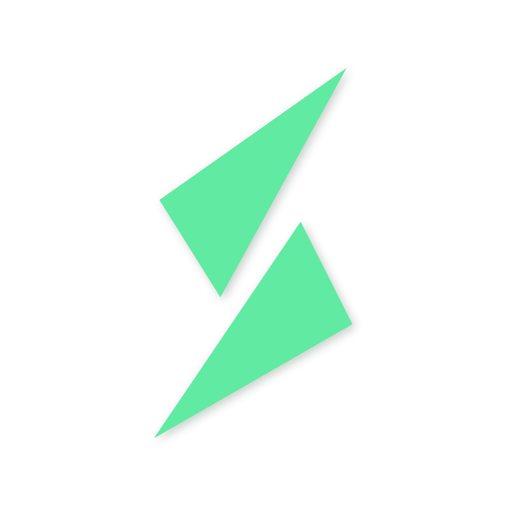
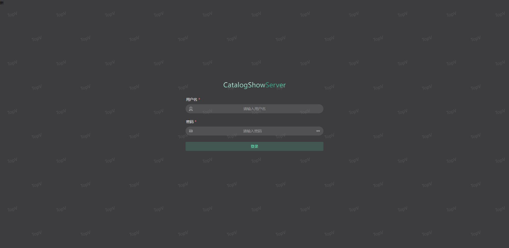
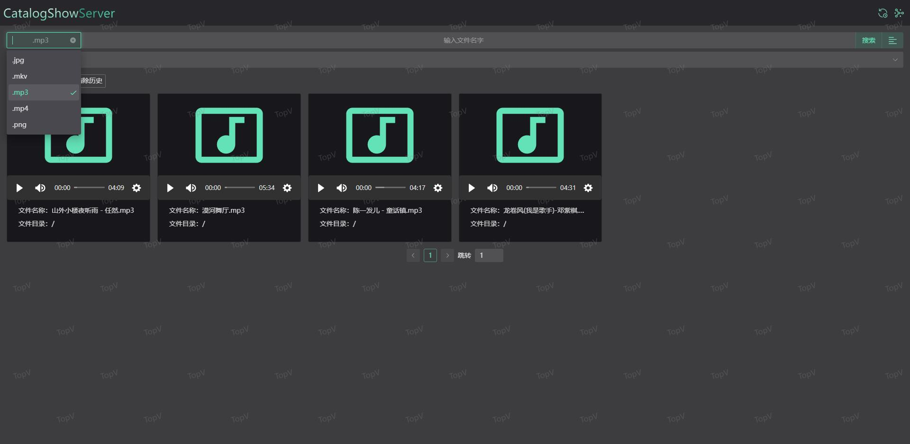
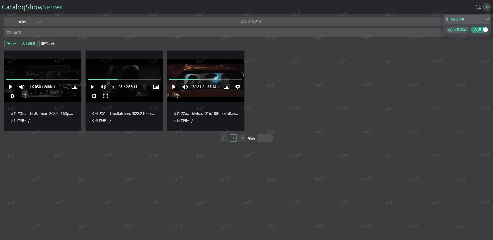

# CatalogShowServer

CatalogShowServer is a file server based on go and vue3. It is also the 2.0 version of TopV

## Screenshot

## 🌎 Browsers

CatalogShowServer can run in the following browsers

- Edge 79+
- Firefox 68+
- Chrome 61+
- Safari 11+
- iOS Safari 11+
- Opera 48+

## 🧩 AbleFileType
-  .gif .jpg .jpeg .png .bmp .psd .mp4 .rmvb .avi .mpeg .mpg .m4v .mkv .mov .wmv .asx .mp3 .wav .ogg

## 🖥️ Usage

+ Copy the build folder in the directory to the folder you need to map
+ config.toml file is used to set the type of exposed file and network port
  + The ableFileType field is used to configure the file type 
  + The web-port field is used to configure the network port 
+ login.json file is used to configure the login account password ( Strictly follow the json format )

## 🙋 Support

Welcome to use, and advocate asking questions in the issue

## ❤️ Sponsors

Thank you very much for your sponsorship.
Contact QQ: 335825098